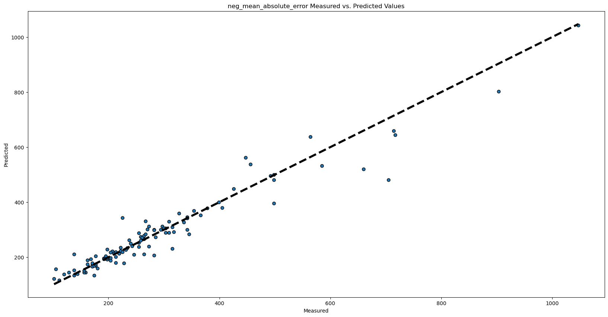

# JoDa
Joda kurssin repo.

Kurssi työnä on ennustaa Tampereella olevien asuntojen hintojen määrää annetusta datasta. 
Opetusdata löytyy [JoDa 2024 repo](https://github.com/InfoTUNI/joda2024/tree/main/assignment/6.2%20Price%20Prediction/data).

## Ensimmäiset tulokset XGBoost 

Siistin dataa tampere_reg skriptillä ja kokeilin ensimmäisiä XGBoost ajoja. 
Tarkoituksena hakea hyvin suoriutuva NN verkko eri k-fold osituksille ja käyttää näiden featureja XGBoost opetusaineistonta. 
Baselinenä käytän pelkkää XGBoost puhdistettuun dataan.

## Baseline XGBoost tuloksia

Koska datasetti on pieni ja en vielä ole saanut JoDa repon testiaineiston hintoja, toteutin train test splitin 10% testiaineistolla. 
Sovitettua mallia verrattiin tähän testiaineistoon ja tämän hetkiset tulokset siitä alla.

| Mittari               | Arvo    |
|-----------------------|---------|
| Mean squared error    | 1851.54 |
| Mean absolute error   | 25.80   |
| RMSLE                 | 0.1286  |
| Parhaan mallin R²-arvo| 0.9269  |

| Mittari               | Arvo    |
|-----------------------|---------|
| Mean squared error    | 2199.94 |
| Mean absolute error   | 29.09   |
| RMSLE                 | 0.1393  |
| Parhaan mallin R²-arvo| 0.9132  |
